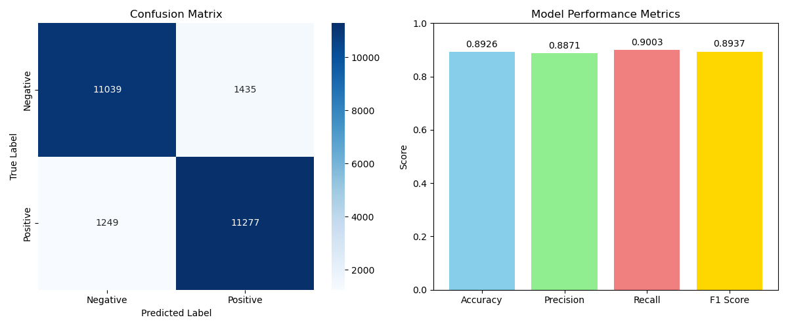
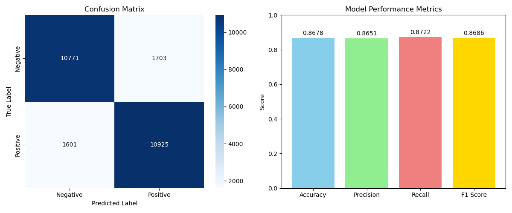

# 实验名称：不同数据度量下的KNN情感分类性能比较实验

## 实验结果（KNN：TF‑IDF 表征，欧氏 vs 余弦）

- **特征**：TF‑IDF`（max_features=10000, ngram_range=(1,2)）`
- **度量**：欧氏距离、余弦相似度（已取消 L2 归一化，使用 `norm=None`，便于观察差异）
- **验证集最优 K**：
  - 欧氏距离：K = 15
  - 余弦相似度：K = 11
- **测试集准确率**：
  - 欧氏距离（K=15）：0.6273
  - 余弦相似度（K=11）：0.7205
- **结论**：在本次设置下，余弦相似度更优

补充：若在 TF‑IDF 中使用默认 L2 归一化（`norm='l2'`），欧氏距离与余弦度量在单位长度空间中单调等价，通常会得到完全相同的近邻排序与准确率；本项目在 `knn_tfidf.py` 中显式设置 `norm=None` 以避免该等价性，从而比较两种度量的真实差异。

# 实验名称：基于TF-IDF文本表示的PCA与t-SNE可视化实验

## PCA （主成分分析）
 ###  计算方法：

- 样本去中心化（以：二维样本数据为例）
  $$
  X = [
  x_i - \bar{x}, y_i - \bar{y}
  ]
  $$
  
- 计算协方差矩阵（Covariance Matrix）
  $$
  C = \frac{1}{n-1}X^TX
  $$
  也即：
  $$
  C = \begin{bmatrix}
  \sigma^2_x & \sigma_{xy} \\
  \sigma_{yx} & \sigma^2_y
  \end{bmatrix}
  $$

- 计算$C$ 的特征值和特征向量

  即：求解矩阵方程
  $$
  C\nu = \lambda \nu
  $$
  特征值最大的特征向量是主成分（证明略）
  
- 投影

  创建一个矩阵，将数据投影到主成分上，从而完成PCA
  $$
  P = [\nu_x ,\nu_y]
  $$

### PCA优劣

- 速度非常快，只需要简单线性代数

  复杂度分析：
  $$
  Complexity = O(nd^2+d^3)
  $$
  $d$ 是样本数，$n$ 是特征数

- 处理非线性数据受限

  ---

  

## t-SNE(Hinton的Stochastic Neighbour Embedding的改进版本)

### 本质思想

试图保持高维空间中元素与邻居的距离在低维空间中保持相似

为做到这一点，设计一个损失函数 $Loss(HighDim, LowDim)$ ，此函数可以表示高维和低维表示的距离差异有多大。

最小化此函数，即对 $LowDim$ 做偏导：
$$
\frac{\partial Loss(HighDim,LowDim)}{\partial LowDim}
$$

### 计算方法

- 计算与近邻的距离，并转化为Gaussian distribution( $p_{0,j}=e^-\frac{||x_0-x_j||^2}{2\sigma^2_0} $)

  使用hyperparameter: perplexity来调整钟形曲线的方差

  对每一个样本做相同操作，并归一化每一个高斯分布：
  $$
  P_{i,j}=\frac{e^-\frac{||x_i-x_j||^2}{2\sigma^2_i} }{\Sigma_{k\ne i}e^-\frac{||x_i-x_k||^2}{2\sigma^2_i}}
  $$
  描述低维距离的公式完全相同
  $$
  Q_{i,j}=\frac{e^-{||y_i-y_j||^2} }{\Sigma_{k\ne i}e^-||x_i-x_k||^2}
  $$

- 使两个概率分布尽量接近（衡量标准为Kullback-Leibler divergence）
  $$
  D_{KL}(P||Q)=\sum_{i} P_{i} \log \frac{P_{i}}{Q_{i}}
  $$
  
**常见超参数：**
- `perplexity`（困惑度）：控制每个点局部邻域的平滑程度
- `learning_rate`（学习率）：优化过程中步长
- `n_iter`（迭代步数）：更新次数

**适用场景与注意事项：**
- t-SNE适合于小规模样本(数百至数千)，大规模时计算成本昂贵。
- t-SNE结果对超参数和初始化敏感，多次运行可能略有不同。
- 只适合可视化，不适合特征工程直接下游建模。

### 可视化对比：PCA vs t‑SNE
- 整体观察：`tfidf_pca_tsne.png` 中，PCA 2D 图点云重叠较多；t‑SNE 2D 图更易形成局部簇，但两类仍存在交叠。
- 相对来说，在此项目中 t-SNE的聚类效果较好，但由于降维过大，仍然出现较大面积的重叠。
- PCA 特点：
  - 线性降维，保留全局方差结构，速度快、可解释性强（可查看方差贡献）。
  - 不直接优化类可分性，二维上易出现重叠，难以刻画非线性边界。
- t‑SNE 特点：
  - 非线性、重视局部邻域关系，易形成可视化上的“簇”。
  - 参数敏感（如 perplexity、learning_rate），全局距离与轴尺度不可直接解释，可重复性相对较弱。
- **本实验结论**：在 TF‑IDF 表征下，采用 SVD→t‑SNE（metric=cosine, perplexity=30, learning_rate=200）能更直观地展示局部簇结构；但正负类仍有交叠，说明情感类别在高维空间并非简单线性可分，二维可视化存在信息丢失，应结合定量指标与下游分类结果综合判断。

---

以下为上次作业以及项目说明

---

# IMDB电影评论情感分析

IMDB电影评论情感分析(基于TF-IDF表征和Word2Vec表征)

## 思考题解答：

1. **哪种表征方法在这个任务上表现更好？为什么？**

实际结果如混淆矩阵和性能柱状图所示（下方给出）。在大多数情况下，TF-IDF方法在该任务上简单直接，处理稀疏文本数据时拥有较稳健的表现，尤其是在训练数据不够丰富时；而Word2Vec方法可以捕捉词语之间的语义关系，对于表达方式多样或文本较长的场景更有潜力。实验中，**TF-IDF模型的准确率和F1分数更高，说明TF-IDF在本数据集上表现更好**，原因可能是IMDB影评用词分布较为规律，词频特征就已足够有效。

2. **Word2Vec方法中，直接将所有词向量“平均”得到句子向量，有什么优点和缺点？**

- **优点**：
  - 简单高效，易于实现，计算成本低，训练和推理速度快。
  - 能够一定程度融合整句的整体语义信息。
  - 对词序不敏感，鲁棒性较高。

- **缺点**：
  - 丢失了词序和局部上下文信息，难以区分不同顺序表达的句子。
  - 停用词、无区分性词语的影响未被抑制，可能稀释关键信息。
  - 对长句和短句的分布不敏感，不考虑词语的重要性。

---

**模型混淆矩阵示例：**


- **TF-IDF + Logistic Regression**



- **Word2Vec + Logistic Regression**




## 数据集来源

https://www.kaggle.com/datasets/lakshmi25npathi/imdb-dataset-of-50k-movie-reviews?resource=download&select=IMDB+Dataset.csv

按照kaggle要求，采用前50%数据进行训练和验证（做80%、20%分割），后50%进行测试。

## 引用

IMDB数据集最初由斯坦福大学发布，用于情感分析研究：

> Maas, A. L., Daly, R. E., Pham, P. T., Huang, D., Ng, A. Y., & Potts, C. (2011). Learning word vectors for sentiment analysis. In *Proceedings of the 49th annual meeting of the association for computational linguistics: Human language technologies* (pp. 142-150).

**BibTeX引用:**
```bibtex
@InProceedings{maas-EtAl:2011:ACL-HLT2011,
    author = {Maas, Andrew L. and Daly, Raymond E. and Pham, Peter T. and Huang, Dan and Ng, Andrew Y. and Potts, Christopher},
    title = {Learning Word Vectors for Sentiment Analysis},
    booktitle = {Proceedings of the 49th Annual Meeting of the Association for Computational Linguistics: Human Language Technologies},
    month = {June},
    year = {2011},
    address = {Portland, Oregon, USA},
    publisher = {Association for Computational Linguistics},
    pages = {142--150},
    url = {http://www.aclweb.org/anthology/P11-1015}
}
```

##  项目结构

```
imdb-sentiment-analysis/
│
├── preprocess.py                 # 数据预处理脚本
├── features.py                   # 数据加载与特征封装（TF-IDF/Word2Vec）
├── models.py                     # 逻辑回归与KNN（K搜索/评估）
├── tf_idf.py                     # TF-IDF + 逻辑回归基线
├── knn_tfidf.py                  # TF-IDF + KNN（欧氏/余弦对比）
├── tf_idf_confusion_matrix.png   # 评测结果
├── word2Vec.py                   # Word2Vec + 逻辑回归基线
├── word2vec_confusion_matrix.png # 评测结果
├── IMDB Dataset.csv              # 原始数据集（kaggle）
├── IMDB_Dataset_Preprocessed.csv # 预处理结果
│  
└── README.md
```

## 开始

### 1. 环境要求

- numpy==1.26.4
- pandas==2.2.2
- scikit-learn==1.4.2
- matplotlib==3.8.4
- seaborn==0.13.2
- gensim==4.3.2
- beautifulsoup4==4.12.3
- lxml==5.2.1
- nltk==3.8.1

### 2. 安装依赖

```bash
# 基础依赖
conda create -n datasci_imdb_new -c conda-forge -y python=3.10
conda activate datasci_imdb_new
conda install -c conda-forge -y numpy pandas scikit-learn matplotlib seaborn
conda install -c conda-forge -y beautifulsoup4 lxml nltk
conda install -c conda-forge -y gensim
python -m ipykernel install --user --name=datasci_imdb_new --display-name "Python (datasci_imdb_new)"
```

### 3. 使用方法

#### 步骤1: 数据预处理
```bash
python preprocess.py
```
- 移除HTML标签
- 转换为小写
- 清理特殊字符
- 规范化空白字符


#### 步骤2: 使用 TF-IDF + 逻辑回归训练与评测

```bash
python tf_idf.py
```
- 自动载入预处理后的 `IMDB_Dataset_Preprocessed.csv`
- 输出主要模型评测指标（Accuracy, Precision, Recall, F1 Score）
- 显示并保存混淆矩阵与性能柱状图

#### 步骤3: 使用 TF-IDF + KNN（欧氏/余弦）对比

```powershell
python knn_tfidf.py
```
- 自动载入预处理后的 `IMDB_Dataset_Preprocessed.csv`
- 在验证集上为欧氏/余弦分别搜索最优 K，并在测试集输出准确率对比
- 说明：脚本默认在 TF‑IDF 构建中取消 L2 归一化（`norm=None`），用于对比两种度量的真实差异

#### 步骤4: 使用 Word2Vec + 逻辑回归训练与评测

```bash
python word2Vec.py
```
- 自动载入预处理后的 `IMDB_Dataset_Preprocessed.csv`
- 输出主要模型评测指标（Accuracy, Precision, Recall, F1 Score）
- 显示并保存混淆矩阵与性能柱状图


#### 步骤5: TF‑IDF 可视化（PCA 与 t‑SNE）

```powershell
python pca_tsne_tfidf.py
```
- 从全量预处理文本中分层子采样（默认最多 5000 条）
- 构建 TF‑IDF 特征（与前述设置一致）
- 使用 TruncatedSVD 模拟 PCA 到 2D；再用 SVD→t‑SNE 到 2D
- 输出并保存图像 `tfidf_pca_tsne.png`


